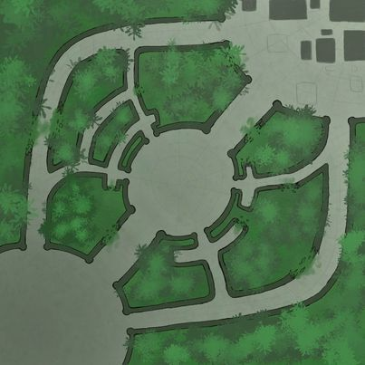

# The PYnals 
## Flag capture with characters

## 🎯 Description
The Pynals is a game developed in Python with the library [PytactX by Jusdeliens](https://jusdeliens.com/).
> 2 teams are fighting agaisnt each other to stay in the flag zone without any ennemy in with them.
## 🎲 Rules
### Components of the arena

_Map size: 30x30_

### Players 
There is 3 different profiles.

|Statistics|Light|Medium|Heavy|
|-----|-----|-----|-----|
|Life points|30|60|100|
|Couldown between 2 moves|100|250|500|
|Couldown between 2 fires|200|400|800|
|Hit fire|15|25|30|

### How to play
You and your team spawn in one of the two sides of the map. You choose one of 3 profiles and try to stay in the flag area.

### How to win
You must stay in the flag area 10 seconds to won one round. The first who gain 5 round win.

## 🎮 Use cases
### Player
- choose his name
- move in x or y in 1 move with agent.move(dX,dY)
- turn in four directions (N, S, W, E) with agent.lookAt(dir)
- reload with reload()
## ✅ pre-requisties
- Python 3.12 or higher
- An arena in Pytactx
## ⚙️ Installation
Installation of necesary packages automatically occur when an agent is created
## 🧪 Tests
## 🛣️ Roadmap
## 🧑‍💻 Author
Pytactx by Julien Arné

Designed by Mathys Tola

Inspirated by Swevvenn

Developped by :
- Maxaug61
- Malagagne
- Swevvenn

## ⚖️ License
